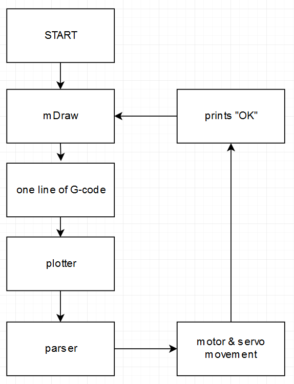
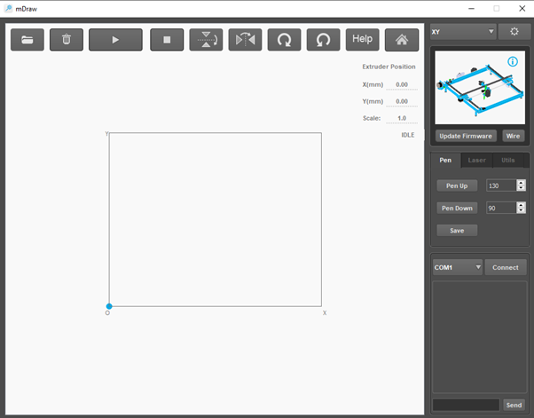
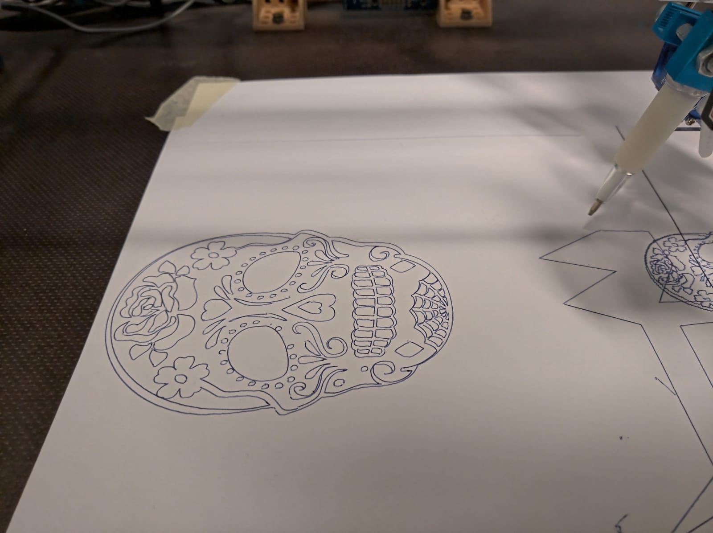

# XY-Plotter
Project's idea was to create a XY-plotter to work with mDraw

mDraw sends G-codes to an LPC1549 where they are converted to motor movement or pencil movement

The movement uses the Bresenham's line algorithm and a RIT timer

The plotter consists of frame, two stepper motors and their driver chips and a servo to control pencil
movement

Program FlowChart

mDraw

Final Drawing

